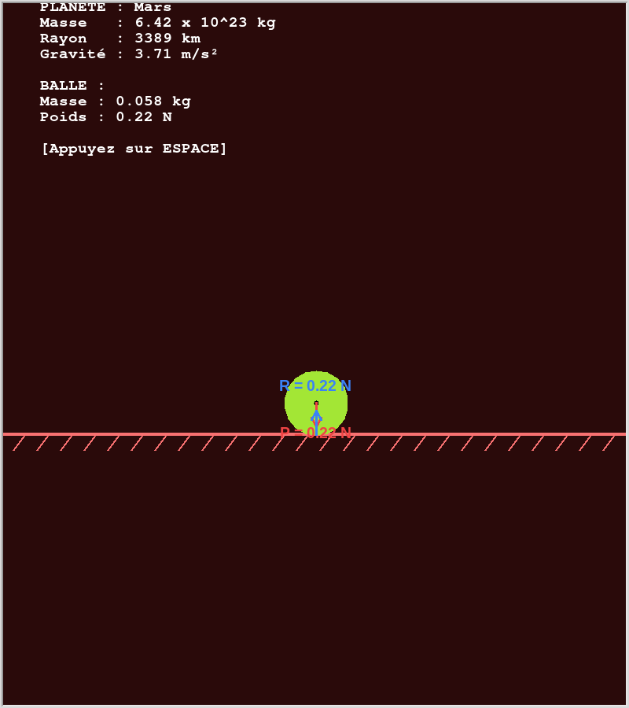

# Représentation des Forces de Gravité

Un petit programme interactif en Python (utilisant la bibliothèque `turtle`) qui permet de visualiser simplement les forces exercées sur une balle de tennis posée sur le sol de différentes planètes de notre système solaire.

## Aperçu



## Fonctionnalités

- **Calcul physique en temps réel** : Affiche le Poids (`P`) et la Réaction du support (`R`) en fonction de la gravité de chaque planète.
- **Vecteurs proportionnels** : La longueur des flèches des forces (Poids et Réaction) s'adapte automatiquement à l'intensité de la gravité ($g$).
- **Interface dynamique** : L'arrière-plan, le sol et les bordures changent de couleur pour correspondre à l'esthétique de la planète sélectionnée.
- **Toutes les planètes** : Contient des données physiques précises pour Mercure, Vénus, la Terre, la Lune, Mars, Jupiter, Saturne, Uranus et Neptune.

## Comment l'utiliser ?

1. Assurez-vous d'avoir Python d'installé sur votre machine.
2. Téléchargez le projet et lancez le script dans votre terminal :
   ```bash
   python main.py
   ```
3. Une fenêtre graphique va s'ouvrir.
4. **Appuyez sur la touche `ESPACE`** de votre clavier pour voyager à travers le système solaire et voir les forces s'adapter instantanément !
